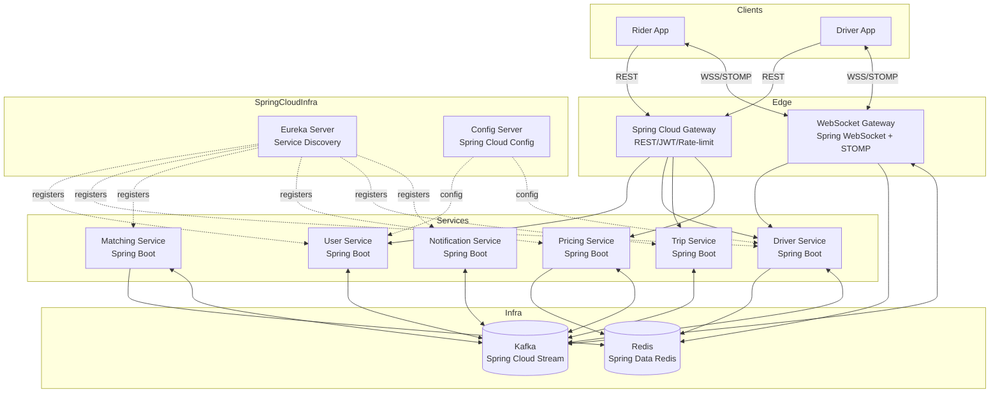
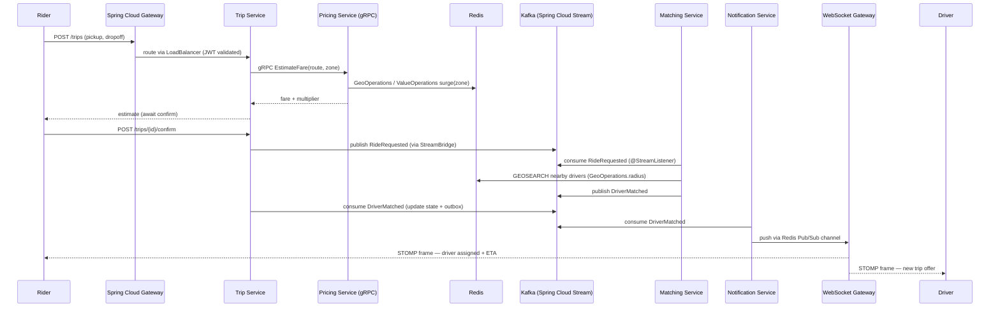

# 01 — Architecture Overview (Spring Boot & Spring Cloud)

## 1. System shape

The platform is a set of independently deployable **Spring Boot** services behind a
**Spring Cloud Gateway**, coordinated through synchronous calls (REST/gRPC) for
request/response work and an asynchronous event log (Kafka via **Spring Cloud
Stream**) for state propagation. A dedicated Spring WebSocket gateway handles all
persistent client connections (live location, trip updates).



---

## 2. Spring Cloud infrastructure services

Before the application services, two Spring Cloud infrastructure services must be
running. Every Spring Boot service is a client of both.

### Spring Cloud Config Server
Centralized configuration source. All `application.yml` files live in a Git
repository; services pull their config on startup. Config changes are pushed to
running instances via Spring Cloud Bus (Kafka-backed) or individual
`/actuator/refresh` calls.

```yaml
# Each service's bootstrap.yml
spring:
  config:
    import: "configserver:http://config-server:8888"
  application:
    name: user-service
```

### Spring Cloud Netflix Eureka Server
Service registry for peer-to-peer discovery. Every service registers itself and
discovers peers by logical name (e.g. `http://matching-service/...`). Spring Cloud
LoadBalancer resolves the name to an actual host.

```yaml
# Each service's application.yml
eureka:
  client:
    service-url:
      defaultZone: http://eureka-server:8761/eureka/
```

> In Kubernetes, you can replace Eureka with **Spring Cloud Kubernetes** discovery,
> which uses K8s Service DNS natively and drops the Eureka cluster.

---

## 3. Communication patterns

### a. REST (Spring Web MVC) — edge-facing
Used at the API Gateway boundary and for endpoints that external clients call.
Spring Cloud Gateway routes JWT-validated, rate-limited requests to downstream
services using Spring Cloud LoadBalancer for instance selection.

```yaml
# Spring Cloud Gateway route example
spring:
  cloud:
    gateway:
      routes:
        - id: trip-service
          uri: lb://trip-service
          predicates:
            - Path=/trips/**
          filters:
            - AuthJwtFilter
            - name: RequestRateLimiter
              args:
                redis-rate-limiter.replenishRate: 100
                redis-rate-limiter.burstCapacity: 200
```

### b. gRPC — service-to-service
Used when the caller needs an immediate answer to proceed. Each service exposes a
gRPC server via `grpc-spring-boot-starter` (net.devh). Stubs are generated from
`.proto` files shared in a common module.

```java
// gRPC server side (e.g. Pricing Service)
@GrpcService
public class PricingGrpcService extends PricingServiceGrpc.PricingServiceImplBase {
    @Override
    public void estimateFare(EstimateFareRequest req, StreamObserver<FareResponse> obs) {
        // ...
    }
}

// gRPC client side (e.g. Trip Service calls Pricing)
@GrpcClient("pricing-service")
private PricingServiceGrpc.PricingServiceBlockingStub pricingStub;
```

Resilience4j circuit breaker wraps every stub call:

```java
CircuitBreaker cb = circuitBreakerFactory.create("pricing");
FareResponse fare = cb.run(
    () -> pricingStub.estimateFare(request),
    ex -> fallbackFare()
);
```

### c. Spring Cloud Stream (Kafka) — async events
Used to propagate facts that already happened. Producers declare `Supplier<Message>`
beans; consumers declare `Consumer<Message>` beans. Spring Cloud Stream wires these
to Kafka topics automatically.

```java
// Producer (Trip Service publishes RideRequested)
@Bean
public Supplier<Message<RideRequestedEvent>> rideRequested() {
    return () -> MessageBuilder
        .withPayload(event)
        .setHeader(KafkaHeaders.KEY, event.getTripId())
        .build();
}

// Consumer (Matching Service reacts)
@Bean
public Consumer<Message<RideRequestedEvent>> onRideRequested() {
    return message -> matchingService.dispatch(message.getPayload());
}
```

```yaml
# application.yml bindings
spring:
  cloud:
    stream:
      bindings:
        rideRequested-out-0:
          destination: ride.requests
          contentType: application/json
        onRideRequested-in-0:
          destination: ride.requests
          group: matching-service
```

### d. Spring WebSocket + STOMP — real-time push
Used for continuous, low-latency flows to connected clients. The dedicated WebSocket
Gateway service uses Spring's `WebSocketMessageBrokerConfigurer` with STOMP over
WebSocket, backed by a Redis Pub/Sub message relay for horizontal scaling.

See [03-realtime-websockets.md](./03-realtime-websockets.md) for the full design.

---

## 4. End-to-end flow: requesting a ride



---

## 5. Why these boundaries (unchanged reasoning, Spring mapping)

| Service | Isolation reason | Spring boundary |
|---------|-----------------|-----------------|
| **User vs Driver** | Different identity flows and lifecycles | Separate Spring Boot apps, separate DBs, separate JWT scopes |
| **Matching** | Most latency-sensitive, algorithmic volatility | No JPA on hot path — pure `RedisTemplate` calls |
| **Pricing** | Surge logic changes independently, must be A/B-testable | Isolated Spring Boot app; feature flags via Config Server |
| **Trip** | Transactional heart with CQRS | Spring Data JPA write side + Spring Data MongoDB read side |
| **Notification** | Pure side-effect, must never block core flows | Spring Cloud Stream consumer only; no synchronous API |

---

## 6. Cross-cutting concerns (Spring implementations)

| Concern | Implementation |
|---------|---------------|
| **AuthN at gateway** | `spring-cloud-gateway` + custom `GlobalFilter` validating RS256 JWT via Spring Security OAuth2 Resource Server |
| **AuthZ in services** | `spring-boot-starter-oauth2-resource-server`; method-level `@PreAuthorize` |
| **Service-to-service auth** | mTLS configured in Spring Boot via `server.ssl.*` + client keystore |
| **Idempotency** | Idempotency key in HTTP header; `@Transactional` + unique constraint on `idempotency_key` column |
| **Distributed tracing** | `micrometer-tracing-bridge-otel` + `opentelemetry-exporter-zipkin`; `trip_id` propagated as Baggage |
| **Structured logging** | Logback JSON encoder; MDC populated with `traceId`, `spanId`, `tripId` |
| **Config refresh** | Spring Cloud Bus over Kafka; `@RefreshScope` on beans that read surge caps or fare rules |
| **Health & readiness** | Spring Boot Actuator `/actuator/health` with liveness + readiness probes for Kubernetes |
