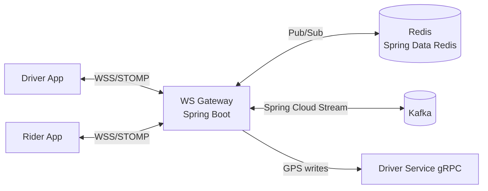
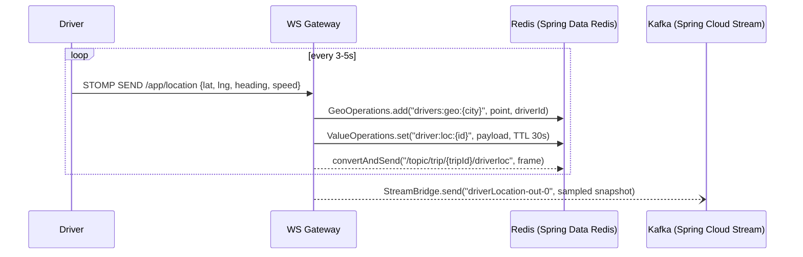

# 03 — Real-time & WebSockets (Spring WebSocket + STOMP + Redis Pub/Sub)

The platform's hardest engineering challenge: continuously moving GPS positions,
live tracking, and instant trip-state updates for many concurrent clients at low
latency. This doc covers the Spring WebSocket gateway and the Spring Data Redis
geospatial design.

---

## 1. The WebSocket Gateway (Spring Boot service)

A **dedicated, stateless Spring Boot service** terminates all persistent client
connections (riders and drivers) using **Spring WebSocket with STOMP** over WSS,
backed by a **Redis Pub/Sub message broker relay** for horizontal scaling.



### STOMP broker configuration

```java
@Configuration
@EnableWebSocketMessageBroker
public class WebSocketConfig implements WebSocketMessageBrokerConfigurer {

    @Override
    public void configureMessageBroker(MessageBrokerRegistry registry) {
        // Redis Pub/Sub relay — any pod can publish to any subscriber
        registry.enableStompBrokerRelay("/topic", "/queue")
                .setRelayHost("redis")
                .setRelayPort(6379);
        registry.setApplicationDestinationPrefixes("/app");
    }

    @Override
    public void registerStompEndpoints(StompEndpointRegistry registry) {
        registry.addEndpoint("/ws")
                .setAllowedOriginPatterns("*")
                .withSockJS();
    }
}
```

### JWT authentication at handshake

```java
@Component
public class JwtHandshakeInterceptor implements HandshakeInterceptor {

    private final JwtDecoder jwtDecoder;

    @Override
    public boolean beforeHandshake(ServerHttpRequest req, ServerHttpResponse res,
                                   WebSocketHandler wsHandler, Map<String, Object> attrs) {
        String token = extractToken(req);
        try {
            Jwt jwt = jwtDecoder.decode(token);
            attrs.put("userId", jwt.getSubject());
            return true;
        } catch (JwtException e) {
            res.setStatusCode(HttpStatus.UNAUTHORIZED);
            return false;
        }
    }
}
```

### Connection registry in Redis

Any gateway pod needs to route an outbound message to the pod that holds a given
user's socket. The registry maps `userId → sessionId` in Redis:

```java
@Component
public class ConnectionRegistry {

    private final RedisTemplate<String, String> redisTemplate;

    public void register(String userId, String sessionId) {
        redisTemplate.opsForValue().set(
            "ws:conn:" + userId, sessionId, Duration.ofHours(24)
        );
    }

    public void deregister(String userId) {
        redisTemplate.delete("ws:conn:" + userId);
    }
}
```

Because STOMP broker relay uses Redis Pub/Sub internally, sending a message to
`/topic/user/{userId}` reaches the correct pod without the gateway needing to know
which pod holds the socket.

---

## 2. Driver location ingestion (the firehose)



```java
@Controller
public class LocationController {

    private final GeoOperations<String, String> geoOps;
    private final ValueOperations<String, String> valueOps;
    private final SimpMessagingTemplate messagingTemplate;
    private final StreamBridge streamBridge;

    @MessageMapping("/location")
    public void handleLocation(@Payload GpsFrame frame,
                               @Header("userId") String driverId,
                               SimpMessageHeaderAccessor headers) {

        String city = resolveCity(frame.getLat(), frame.getLng());

        // Hot write — Redis only, never touches JPA
        geoOps.add("drivers:geo:" + city,
                   new Point(frame.getLng(), frame.getLat()), driverId);
        valueOps.set("driver:loc:" + driverId,
                     toJson(frame), Duration.ofSeconds(30));

        // Fan-out to the rider watching this driver
        String tripId = valueOps.get("driver:trip:" + driverId);
        if (tripId != null) {
            messagingTemplate.convertAndSend(
                "/topic/trip/" + tripId + "/driverloc", frame
            );
        }

        // Sample 1 in N frames to Kafka for analytics
        if (shouldSample()) {
            streamBridge.send("driverLocation-out-0",
                              LocationSnapshot.from(driverId, frame));
        }
    }
}
```

Key decisions:
- **Hot write goes only to Redis** via `GeoOperations.add()` — never through a JPA
  `save()` on the critical path.
- **TTL on every key** so a crashed driver app disappears from matching within 30s.
- **STOMP fan-out** via `SimpMessagingTemplate.convertAndSend()` — the Redis broker
  relay delivers it to the correct subscriber pod.

---

## 3. Live tracking (rider watches driver)

When a driver is assigned to a trip, the rider's app subscribes to a STOMP topic.

```
Client SUBSCRIBE /topic/trip/{tripId}/driverloc
```

Each GPS frame for that trip is published to the same topic and the Redis broker
relay delivers it to the subscribed rider. When the trip ends:

```java
// Trip Service publishes TripCompleted → WS Gateway consumes → unsubscribes
messagingTemplate.convertAndSend(
    "/topic/trip/" + tripId + "/state",
    Map.of("status", "completed")
);
// Client unsubscribes on receiving status: completed
```

**ETA updates** are pushed to the same topic at a lower cadence by the Matching
or Trip service, computed from current driver position + routing API.

---

## 4. Trip-state push (consuming Kafka events)

The WebSocket Gateway is a **Spring Cloud Stream consumer** of trip lifecycle events.
When it receives a `DriverMatched` or `TripStarted` event, it pushes a STOMP frame
to the rider and driver topics simultaneously.

```java
@Bean
public Consumer<Message<TripEvent>> onTripEvent() {
    return message -> {
        TripEvent event = message.getPayload();
        // Push to rider
        messagingTemplate.convertAndSend(
            "/topic/user/" + event.getRiderId() + "/trips", event
        );
        // Push to driver
        messagingTemplate.convertAndSend(
            "/topic/user/" + event.getDriverId() + "/trips", event
        );
    };
}
```

```yaml
spring:
  cloud:
    stream:
      bindings:
        onTripEvent-in-0:
          destination: trip.events
          group: ws-gateway
```

**Fallback:** if the WebSocket is down, clients poll `GET /trips/{id}` through the
REST API via Spring Cloud Gateway. The authoritative state lives in the Trip write
store (PostgreSQL), so polling and WebSocket converge.

---

## 5. Redis geospatial design (Spring Data Redis keys)

```
Key                         Spring Data Redis API          Purpose
drivers:geo:{city}          GeoOperations.add/radius       radius queries for matching
driver:loc:{driver_id}      ValueOperations + TTL          last full payload, heading/speed
driver:status:{id}          ValueOperations + TTL          online | on_trip | offline
driver:trip:{id}            ValueOperations                current tripId (for fan-out)
ws:conn:{user_id}           ValueOperations                session registration
trip:{id}/driverloc         STOMP topic (broker relay)     live position fan-out to rider
```

```java
@Configuration
public class RedisConfig {

    @Bean
    public RedisTemplate<String, String> redisTemplate(RedisConnectionFactory factory) {
        RedisTemplate<String, String> t = new RedisTemplate<>();
        t.setConnectionFactory(factory);
        t.setKeySerializer(new StringRedisSerializer());
        t.setValueSerializer(new StringRedisSerializer());
        return t;
    }

    @Bean
    public GeoOperations<String, String> geoOperations(RedisTemplate<String, String> t) {
        return t.opsForGeo();
    }
}
```

- **Partition the geo set by city** (`drivers:geo:{city}`) — radius queries scan
  only relevant drivers.
- **TTLs everywhere** on volatile keys — offline drivers auto-expire.
- For large deployments, configure Redis Cluster in `spring.data.redis.cluster.*`;
  `Lettuce` (the default driver) handles cluster topology automatically.

---

## 6. Scaling & resilience notes

- **Connection capacity:** size gateway pods by concurrent sockets, not CPU. Spring
  Boot's embedded Netty (WebFlux-based WS) or Tomcat (MVC-based WS) handles
  thousands of concurrent sockets per pod.
- **Horizontal scaling:** STOMP broker relay means any pod can route to any client.
  Kubernetes scales gateway replicas via HPA on memory/connection metrics exposed
  by Spring Boot Actuator.
- **Reconnect storms:** STOMP clients use exponential backoff + jitter. On reconnect
  the client re-subscribes; the gateway rehydrates state from Redis + Trip read model
  (a `GET /trips/active` call through the gateway).
- **Backpressure:** if a client is slow, drop intermediate location frames in the
  `@MessageMapping` handler — the `SimpMessagingTemplate` send is non-blocking; just
  skip the publish if the queue depth exceeds a threshold.
- **Redis HA:** run Redis Sentinel or Cluster; configure Lettuce auto-failover:
  ```yaml
  spring:
    data:
      redis:
        sentinel:
          master: mymaster
          nodes: "redis-sentinel-0:26379,redis-sentinel-1:26379"
  ```
