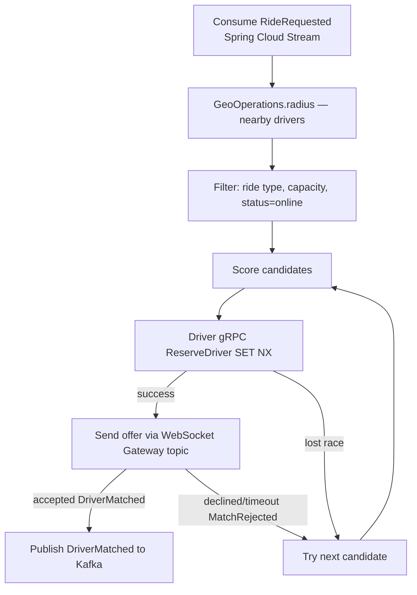

# 07 — Matching Service (Spring Boot)

## Responsibility

The dispatch brain. Given a `RideRequested` event, it finds the **best available
driver** for that rider and assigns them — fast, fairly, and without double-booking.
This is the most latency-sensitive and algorithmically volatile service.

---

## Spring Boot dependencies

```xml
<dependencies>
  <!-- No spring-boot-starter-web — this service has no REST surface -->
  <dependency>
    <groupId>org.springframework.boot</groupId>
    <artifactId>spring-boot-starter-data-redis</artifactId>
  </dependency>
  <dependency>
    <groupId>org.springframework.cloud</groupId>
    <artifactId>spring-cloud-stream</artifactId>
  </dependency>
  <dependency>
    <groupId>org.springframework.cloud</groupId>
    <artifactId>spring-cloud-starter-netflix-eureka-client</artifactId>
  </dependency>
  <!-- gRPC clients for Driver + Pricing -->
  <dependency>
    <groupId>net.devh</groupId>
    <artifactId>grpc-spring-boot-starter</artifactId>
    <version>3.1.0</version>
  </dependency>
  <dependency>
    <groupId>org.springframework.cloud</groupId>
    <artifactId>spring-cloud-starter-circuitbreaker-resilience4j</artifactId>
  </dependency>
</dependencies>
```

---

## Core flow



---

## Event consumer (entry point)

```yaml
# application.yml
spring:
  cloud:
    stream:
      bindings:
        onRideRequested-in-0:
          destination: ride.requests
          group: matching-service
          consumer:
            partitioned: true              # one consumer per city partition
            concurrency: 4
        onMatchRejected-in-0:
          destination: match.events
          group: matching-service
        driverMatched-out-0:
          destination: match.events
          producer:
            partition-key-expression: headers['trip_id']
```

```java
@Configuration
public class MatchingConsumers {

    private final MatchingService matchingService;

    @Bean
    public Consumer<Message<RideRequestedEvent>> onRideRequested() {
        return message -> {
            RideRequestedEvent event = message.getPayload();
            // Idempotency guard — skip if already dispatching this tripId
            if (matchingService.isAlreadyDispatching(event.getTripId())) return;
            matchingService.dispatch(event);
        };
    }

    @Bean
    public Consumer<Message<MatchRejectedEvent>> onMatchRejected() {
        return message -> matchingService.retryDispatch(message.getPayload().getTripId());
    }
}
```

---

## Geospatial search with Spring Data Redis

```java
@Service
public class MatchingService {

    private final RedisTemplate<String, String> redisTemplate;
    private final DriverServiceGrpc.DriverServiceBlockingStub driverStub;
    private final PricingServiceGrpc.PricingServiceBlockingStub pricingStub;
    private final StreamBridge streamBridge;
    private final CircuitBreakerFactory cbFactory;

    public void dispatch(RideRequestedEvent event) {
        double initialRadiusKm = 2.0;
        double maxRadiusKm = 10.0;
        double radius = initialRadiusKm;

        while (radius <= maxRadiusKm) {
            List<DriverCandidate> candidates = findAndScore(
                event.getPickup(), radius, event.getRideType(), event.getCity()
            );

            for (DriverCandidate candidate : candidates) {
                if (tryReserveAndOffer(candidate, event)) return;
            }

            radius *= 2;    // expand radius on no candidates
        }

        // No driver found
        streamBridge.send("match.events-out-0",
            NoDriversAvailableEvent.of(event.getTripId()));
    }

    private List<DriverCandidate> findAndScore(
            GeoPoint pickup, double radiusKm, RideType rideType, String city) {

        GeoOperations<String, String> geo = redisTemplate.opsForGeo();
        GeoResults<RedisGeoCommands.GeoLocation<String>> nearby = geo.radius(
            "drivers:geo:" + city,
            new Circle(
                new Point(pickup.getLng(), pickup.getLat()),
                new Distance(radiusKm, Metrics.KILOMETERS)
            ),
            GeoRadiusCommandArgs.newGeoRadiusArgs()
                .includeDistance()
                .sortAscending()
                .limit(20)
        );

        return nearby.getContent().stream()
            .map(r -> buildCandidate(r, rideType))
            .filter(c -> c != null && c.isEligible())
            .sorted(Comparator.comparingDouble(DriverCandidate::getScore).reversed())
            .collect(toList());
    }

    private DriverCandidate buildCandidate(
            GeoResult<RedisGeoCommands.GeoLocation<String>> geoResult,
            RideType rideType) {

        String driverId = geoResult.getContent().getName();
        String status = redisTemplate.opsForValue().get("driver:status:" + driverId);

        if (!"online".equals(status)) return null;   // skip on_trip or offline drivers

        double etaMinutes = geoResult.getDistance().getValue() / 30.0; // rough km/min
        return new DriverCandidate(driverId, etaMinutes, rideType);
    }

    private boolean tryReserveAndOffer(DriverCandidate candidate, RideRequestedEvent event) {
        // Atomic reservation via gRPC → Redis SET NX
        CircuitBreaker cb = cbFactory.create("driver-reserve");
        ReserveDriverResponse resp = cb.run(
            () -> driverStub.reserveDriver(
                ReserveDriverRequest.newBuilder()
                    .setDriverId(candidate.getDriverId())
                    .setTripId(event.getTripId())
                    .setTtlSeconds(15)
                    .build()
            ),
            ex -> ReserveDriverResponse.newBuilder().setSuccess(false).build()
        );

        if (!resp.getSuccess()) return false;

        // Lock fare at match time via Pricing gRPC
        pricingStub.lockFare(LockFareRequest.newBuilder()
            .setTripId(event.getTripId())
            .setZone(event.getZone())
            .build());

        // Publish DriverMatched
        streamBridge.send("match.events-out-0",
            DriverMatchedEvent.of(
                event.getTripId(),
                candidate.getDriverId(),
                candidate.getEtaMinutes()
            ));

        return true;
    }

    public boolean isAlreadyDispatching(String tripId) {
        return Boolean.TRUE.equals(
            redisTemplate.opsForValue().setIfAbsent(
                "dispatching:" + tripId, "1", Duration.ofMinutes(5)
            )
        ) == false;  // returns false if key already existed (i.e. already dispatching)
    }
}
```

---

## Scoring

```java
public class DriverCandidate {

    private final String driverId;
    private final double etaMinutes;
    private final RideType rideType;
    private double rating;
    private double acceptanceRate;
    private long idleSeconds;

    // Pluggable scoring — weights can be tuned via Config Server without redeployment
    public double getScore() {
        return  (1.0 / (etaMinutes + 0.1)) * etaWeight
              + rating                       * ratingWeight
              + acceptanceRate               * acceptanceWeight
              + Math.log1p(idleSeconds)      * fairnessWeight;
    }
}
```

Scoring weights live in Config Server so the dispatch strategy can be adjusted
without redeployment:

```yaml
# In Git config repo: matching-service.yml
matching:
  scoring:
    eta-weight: 0.6
    rating-weight: 0.2
    acceptance-weight: 0.1
    fairness-weight: 0.1
```

```java
@ConfigurationProperties(prefix = "matching.scoring")
@RefreshScope
@Component
public class ScoringWeights {
    private double etaWeight = 0.6;
    private double ratingWeight = 0.2;
    // ...
}
```

---

## Key design decisions

- **Reservation, not assignment:** the top driver is tentatively reserved with a
  15-second Redis TTL via `setIfAbsent`. If they decline or the TTL lapses, the lock
  auto-releases and the next candidate is tried. Prevents double-booking without any
  distributed lock manager.
- **Expanding radius:** start at 2 km; double on no candidates up to 10 km cap, then
  emit `NoDriversAvailable`.
- **Idempotent dispatch:** `dispatching:{tripId}` Redis key prevents re-entrant
  dispatch if `RideRequested` is re-delivered by Kafka (at-least-once).
- **Backpressure under surge:** `ride.requests` is partitioned by `city`; each city
  scales its matching consumer group independently via Kubernetes HPA on Kafka lag.

---

## Resilience configuration (Resilience4j)

```yaml
resilience4j:
  circuitbreaker:
    instances:
      driver-reserve:
        sliding-window-size: 10
        failure-rate-threshold: 50
        wait-duration-in-open-state: 5s
      pricing-lock:
        sliding-window-size: 10
        failure-rate-threshold: 40
        wait-duration-in-open-state: 10s
  timelimiter:
    instances:
      driver-reserve:
        timeout-duration: 200ms   # reservation must be fast
      pricing-lock:
        timeout-duration: 500ms
```

---

## Scaling & concerns

- **No durable state here** — on restart, Matching re-consumes pending
  `ride.requests` from the last committed Kafka offset and reads the current geo-
  index from Redis.
- Latency target: candidate selection in **low tens of milliseconds** (pure Redis
  reads); the whole match (incl. driver accept window) within a few seconds.
- **Stateless consumers** registered with Eureka; scale by partition count — add
  more partitions to `ride.requests` and add more Matching replicas.
- Tightly coupled to Redis health — if the geo-index degrades, Resilience4j circuit
  breaker widens the staleness tolerance and returns an empty candidate list, which
  triggers the expanding-radius fallback.
