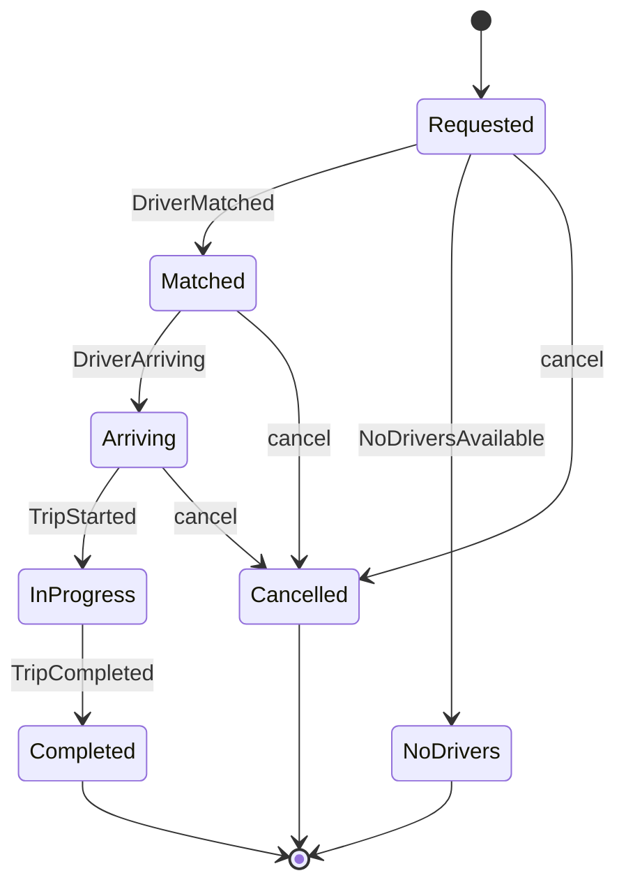

# 09 — Trip Service (Spring Boot + CQRS)

## Responsibility

The **transactional heart** of the platform. Owns the authoritative trip lifecycle
and state, orchestrates the request→match→ride→complete flow via events, and is the
one service implementing **CQRS** — Spring Data JPA on the write side, Spring Data
MongoDB on the read side, with a transactional outbox for reliable event publishing.

---

## Spring Boot dependencies

```xml
<dependencies>
  <dependency>
    <groupId>org.springframework.boot</groupId>
    <artifactId>spring-boot-starter-web</artifactId>
  </dependency>
  <dependency>
    <groupId>org.springframework.boot</groupId>
    <artifactId>spring-boot-starter-data-jpa</artifactId>
  </dependency>
  <dependency>
    <groupId>org.springframework.boot</groupId>
    <artifactId>spring-boot-starter-data-mongodb</artifactId>
  </dependency>
  <dependency>
    <groupId>org.springframework.cloud</groupId>
    <artifactId>spring-cloud-stream</artifactId>
  </dependency>
  <dependency>
    <groupId>net.devh</groupId>
    <artifactId>grpc-spring-boot-starter</artifactId>
    <version>3.1.0</version>
  </dependency>
  <dependency>
    <groupId>org.springframework.cloud</groupId>
    <artifactId>spring-cloud-starter-circuitbreaker-resilience4j</artifactId>
  </dependency>
</dependencies>
```

---

## Trip lifecycle (state machine)



Each transition is a command applied inside a `@Transactional` method, producing a
domain event written to the outbox.

---

## CQRS structure

```mermaid
flowchart LR
    CMD[REST Commands<br/>POST /trips] --> H[TripCommandService<br/>@Transactional]
    H --> PG[(PostgreSQL<br/>Spring Data JPA<br/>trips + trip_events + outbox)]
    PG --> RELAY[OutboxRelay<br/>@Scheduled / Debezium]
    RELAY --> K[(Kafka trip.events<br/>Spring Cloud Stream)]
    K --> PROJ[TripProjector<br/>@Consumer bean]
    PROJ --> MG[(MongoDB<br/>Spring Data MongoDB<br/>trips_read)]
    QRY[REST Queries<br/>GET /trips] --> MG
```

---

## Write side — Spring Data JPA / PostgreSQL

### Entities

```java
@Entity @Table(name = "trips")
public class Trip {
    @Id private UUID id;
    private UUID riderId;
    private UUID driverId;
    @Enumerated(EnumType.STRING) private TripStatus status;
    @Embedded private GeoPoint pickup;
    @Embedded private GeoPoint dropoff;
    private BigDecimal fareLocked;
    private BigDecimal fareFinal;
    private Instant requestedAt;
    private Instant startedAt;
    private Instant endedAt;
    @Version private Long version;          // optimistic locking

    public RideRequestedEvent confirm(UUID riderId, GeoPoint pickup, GeoPoint dropoff) {
        this.status = TripStatus.REQUESTED;
        this.riderId = riderId;
        this.requestedAt = Instant.now();
        return new RideRequestedEvent(id, riderId, pickup, dropoff, Instant.now());
    }

    public DriverMatchedApplied applyDriverMatched(UUID driverId) {
        if (status != TripStatus.REQUESTED)
            throw new IllegalStateTransitionException(status, "MATCHED");
        this.status = TripStatus.MATCHED;
        this.driverId = driverId;
        return new DriverMatchedApplied(id, driverId);
    }

    public TripStartedEvent start() {
        this.status = TripStatus.IN_PROGRESS;
        this.startedAt = Instant.now();
        return new TripStartedEvent(id, startedAt);
    }

    public TripCompletedEvent complete(double distanceKm, BigDecimal finalFare) {
        this.status = TripStatus.COMPLETED;
        this.endedAt = Instant.now();
        this.fareFinal = finalFare;
        return new TripCompletedEvent(id, riderId, driverId, finalFare, distanceKm, endedAt);
    }

    public TripCancelledEvent cancel(String by, String reason) {
        if (Set.of(TripStatus.COMPLETED, TripStatus.CANCELLED).contains(status))
            throw new IllegalStateTransitionException(status, "CANCELLED");
        this.status = TripStatus.CANCELLED;
        return new TripCancelledEvent(id, by, reason, Instant.now());
    }
}

@Entity @Table(name = "trip_events")
public class TripEventRecord {                  // append-only event log
    @Id @GeneratedValue private UUID id;
    private UUID tripId;
    private String type;
    @Column(columnDefinition = "jsonb") private String payload;
    private Instant occurredAt;
}

@Entity @Table(name = "outbox")
public class OutboxEvent {
    @Id @GeneratedValue private UUID id;
    private UUID aggregateId;
    private String eventType;
    @Column(columnDefinition = "jsonb") private String payload;
    private Instant publishedAt;            // NULL = unpublished
}
```

### Command service

```java
@Service
@Transactional
public class TripCommandService {

    private final TripRepository tripRepo;
    private final TripEventRepository eventRepo;
    private final OutboxRepository outboxRepo;
    private final PricingServiceGrpc.PricingServiceBlockingStub pricingStub;
    private final CircuitBreakerFactory cbFactory;
    private final ObjectMapper mapper;

    public TripDto createTrip(CreateTripCommand cmd) {
        // Estimate fare via Pricing gRPC (circuit-breakered)
        FareEstimateResponse estimate = cbFactory.create("pricing").run(
            () -> pricingStub.estimateFare(EstimateFareRequest.newBuilder()
                .setCity(cmd.getCity())
                .setRideType(cmd.getRideType().name())
                .setDistanceKm(cmd.getEstimatedDistanceKm())
                .build()),
            ex -> FareEstimateResponse.newBuilder()
                .setAmount(baseFareFallback(cmd))
                .setSurgeMultiplier(1.0)
                .build()
        );

        Trip trip = new Trip(UUID.randomUUID());
        trip.setPickup(cmd.getPickup());
        trip.setDropoff(cmd.getDropoff());
        trip.setFareLocked(BigDecimal.valueOf(estimate.getAmount()));
        trip.setStatus(TripStatus.PENDING);
        tripRepo.save(trip);

        return TripMapper.toDto(trip, estimate);
    }

    public void confirmTrip(UUID tripId, UUID riderId) {
        Trip trip = loadTrip(tripId);
        RideRequestedEvent event = trip.confirm(riderId, trip.getPickup(), trip.getDropoff());

        tripRepo.save(trip);
        appendTripEvent(trip.getId(), event);
        saveToOutbox(trip.getId(), "RideRequested", event);
        // Outbox relay publishes to Kafka asynchronously
    }

    public void applyDriverMatched(DriverMatchedEvent event) {
        Trip trip = loadTrip(UUID.fromString(event.getTripId()));
        var applied = trip.applyDriverMatched(UUID.fromString(event.getDriverId()));

        tripRepo.save(trip);
        appendTripEvent(trip.getId(), applied);
        saveToOutbox(trip.getId(), "DriverMatchedApplied", applied);
    }

    private void saveToOutbox(UUID aggregateId, String type, Object event) {
        OutboxEvent outbox = new OutboxEvent();
        outbox.setAggregateId(aggregateId);
        outbox.setEventType(type);
        outbox.setPayload(toJson(event));
        outboxRepo.save(outbox);
    }

    private Trip loadTrip(UUID id) {
        return tripRepo.findById(id)
            .orElseThrow(() -> new TripNotFoundException(id));
    }
}
```

### Outbox relay

```java
@Component
public class OutboxRelay {

    private final OutboxRepository outboxRepo;
    private final StreamBridge streamBridge;
    private final ObjectMapper mapper;

    @Scheduled(fixedDelay = 500)
    @Transactional
    public void relay() {
        List<OutboxEvent> pending =
            outboxRepo.findTop100ByPublishedAtIsNullOrderByIdAsc();

        for (OutboxEvent evt : pending) {
            Message<String> message = MessageBuilder
                .withPayload(evt.getPayload())
                .setHeader(KafkaHeaders.KEY, evt.getAggregateId().toString())
                .setHeader("eventType", evt.getEventType())
                .build();

            streamBridge.send("tripEvents-out-0", message);

            evt.setPublishedAt(Instant.now());
            outboxRepo.save(evt);
        }
    }
}
```

> **Production option:** replace `@Scheduled` relay with **Debezium CDC** reading
> the PostgreSQL WAL. Debezium publishes outbox rows to Kafka directly with
> sub-millisecond latency and removes the polling overhead entirely.

---

## Read side — Spring Data MongoDB

```java
@Document(collection = "trips_read")
public class TripReadModel {
    @Id private String id;                // tripId
    private RiderInfo rider;
    private DriverInfo driver;
    private String status;
    private FareInfo fare;
    private RouteInfo route;
    private List<TimelineEntry> timeline;
    private Instant createdAt;
}

public interface TripReadRepository extends MongoRepository<TripReadModel, String> {
    Page<TripReadModel> findByRiderIdOrderByCreatedAtDesc(String riderId, Pageable pageable);
    Page<TripReadModel> findByDriverIdOrderByCreatedAtDesc(String driverId, Pageable pageable);
    Optional<TripReadModel> findByIdAndStatus(String id, String status);
}
```

### Projector

```java
@Configuration
public class TripProjectorConfig {

    private final TripReadRepository readRepo;
    private final ObjectMapper mapper;

    @Bean
    public Consumer<Message<String>> onTripEvent() {
        return message -> {
            String eventType = (String) message.getHeaders().get("eventType");
            String payload   = message.getPayload();

            switch (eventType) {
                case "RideRequested"     -> handleRideRequested(payload);
                case "DriverMatchedApplied" -> handleDriverMatched(payload);
                case "TripStarted"       -> handleTripStarted(payload);
                case "TripCompleted"     -> handleTripCompleted(payload);
                case "TripCancelled"     -> handleTripCancelled(payload);
            }
        };
    }

    private void handleTripCompleted(String payload) {
        TripCompletedEvent evt = parse(payload, TripCompletedEvent.class);
        TripReadModel doc = readRepo.findById(evt.getTripId()).orElseThrow();
        doc.setStatus("completed");
        doc.getFare().setFinal(evt.getFinalFare());
        doc.getTimeline().add(new TimelineEntry("completed", evt.getOccurredAt()));
        readRepo.save(doc);
    }
    // ... other handlers
}
```

---

## REST API

```java
@RestController
@RequestMapping("/trips")
public class TripController {

    private final TripCommandService commandService;
    private final TripReadRepository readRepo;

    @PostMapping("/estimate")
    public FareEstimateDto estimate(@RequestBody EstimateTripRequest req) {
        return commandService.estimateFare(req);
    }

    @PostMapping
    @ResponseStatus(HttpStatus.CREATED)
    public TripDto createTrip(@AuthenticationPrincipal Jwt jwt,
                               @RequestBody @Valid CreateTripRequest req) {
        return commandService.createTrip(CreateTripCommand.from(jwt, req));
    }

    @PostMapping("/{id}/confirm")
    public ResponseEntity<Void> confirm(@PathVariable UUID id,
                                         @AuthenticationPrincipal Jwt jwt) {
        commandService.confirmTrip(id, UUID.fromString(jwt.getSubject()));
        return ResponseEntity.accepted().build();
    }

    @GetMapping("/{id}")
    public TripReadModel getTrip(@PathVariable String id) {
        return readRepo.findById(id)
            .orElseThrow(() -> new TripNotFoundException(id));
    }

    @PostMapping("/{id}/cancel")
    public ResponseEntity<Void> cancel(@PathVariable UUID id,
                                        @AuthenticationPrincipal Jwt jwt,
                                        @RequestBody CancelRequest req) {
        commandService.cancelTrip(id, jwt.getSubject(), req.getReason());
        return ResponseEntity.accepted().build();
    }
}
```

---

## Spring Cloud Stream bindings

```yaml
spring:
  cloud:
    stream:
      bindings:
        tripEvents-out-0:
          destination: trip.events
          contentType: application/json
        onTripEvent-in-0:
          destination: trip.events
          group: trip-projector
        onDriverMatched-in-0:
          destination: match.events
          group: trip-service
        onFareLocked-in-0:
          destination: pricing.events
          group: trip-service
        onPaymentCaptured-in-0:
          destination: payment.events
          group: trip-service
```

---

## Scaling & concerns

- **Outbox atomically couples state and event** — the `@Transactional` block commits
  both; the relay retries on failure; no dual-write race.
- **Optimistic locking** (`@Version`) prevents lost updates on concurrent commands
  targeting the same trip. Callers retry on `OptimisticLockingFailureException`.
- **Idempotent projector** — store processed `event_id` in the read document to skip
  re-delivered events.
- **Read models are rebuildable** by resetting the `trip-projector` consumer group
  offset to 0 and dropping the MongoDB collection.
- **Per-trip ordering** — Kafka partition key = `trip_id` ensures a single trip's
  events are processed in order.
- **Dual datasource config** — configure separate `DataSource` beans for JPA
  (PostgreSQL) and MongoDB using Spring Boot's multi-datasource pattern; MongoDB
  auto-configuration activates via `spring.data.mongodb.uri`.
