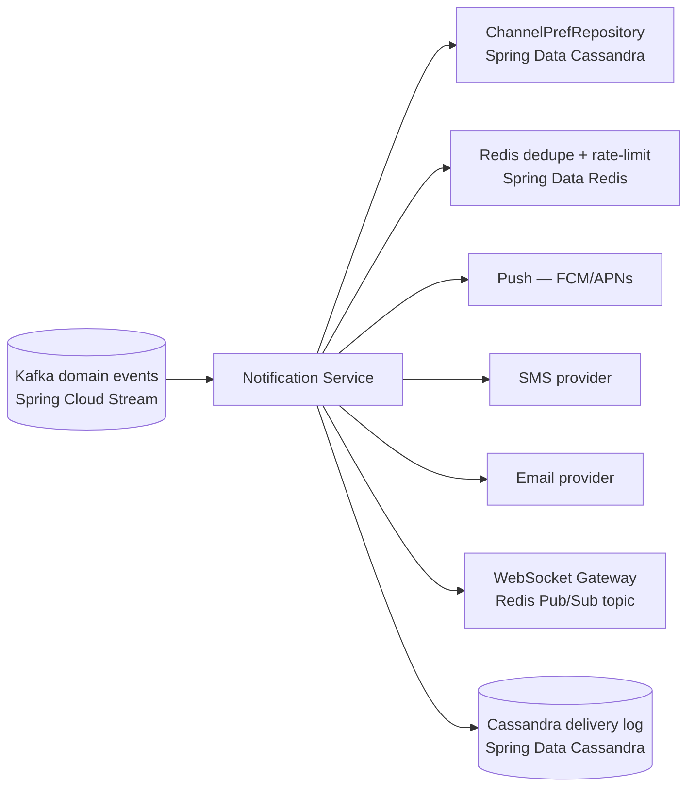

# 10 — Notification Service (Spring Boot)

## Responsibility

Delivers messages to riders and drivers across **multiple channels** — push
(APNs/FCM), SMS, email, and in-app/WebSocket — in reaction to domain events. It is
a **pure Spring Cloud Stream consumer** with no synchronous REST surface on the core
path. It must never block any core flow.

---

## Spring Boot dependencies

```xml
<dependencies>
  <!-- No spring-boot-starter-web — async-only service -->
  <dependency>
    <groupId>org.springframework.boot</groupId>
    <artifactId>spring-boot-starter-data-cassandra</artifactId>
  </dependency>
  <dependency>
    <groupId>org.springframework.boot</groupId>
    <artifactId>spring-boot-starter-data-redis</artifactId>
  </dependency>
  <dependency>
    <groupId>org.springframework.cloud</groupId>
    <artifactId>spring-cloud-stream</artifactId>
  </dependency>
  <dependency>
    <groupId>org.springframework.cloud</groupId>
    <artifactId>spring-cloud-starter-netflix-eureka-client</artifactId>
  </dependency>
  <dependency>
    <groupId>org.springframework.cloud</groupId>
    <artifactId>spring-cloud-starter-circuitbreaker-resilience4j</artifactId>
  </dependency>
  <!-- Push notification SDKs (example) -->
  <dependency>
    <groupId>com.google.firebase</groupId>
    <artifactId>firebase-admin</artifactId>
    <version>9.3.0</version>
  </dependency>
</dependencies>
```

---

## Flow



---

## Datastore — Spring Data Cassandra (+ Redis)

```java
@Table("notifications_by_user")
public class NotificationRecord {

    @PrimaryKeyColumn(ordinal = 0, type = PrimaryKeyType.PARTITIONED)
    private UUID userId;

    @PrimaryKeyColumn(ordinal = 1, type = PrimaryKeyType.CLUSTERED,
                      ordering = Ordering.DESCENDING)
    private Instant sentAt;

    private UUID notificationId;
    private String channel;                 // push | sms | email | in_app
    private String eventType;
    private String status;                  // sent | failed | skipped
    private String providerRef;
}

@Table("channel_prefs")
public class ChannelPrefs {

    @PrimaryKey private UUID userId;
    private boolean pushEnabled;
    private boolean smsEnabled;
    private boolean emailEnabled;
    @Column("quiet_hours") private String quietHoursJson; // "22:00-07:00"
}

public interface NotificationRepository
    extends CassandraRepository<NotificationRecord, NotificationPrimaryKey> { }

public interface ChannelPrefsRepository
    extends CassandraRepository<ChannelPrefs, UUID> { }
```

```yaml
spring:
  data:
    cassandra:
      contact-points: cassandra-0,cassandra-1
      port: 9042
      keyspace-name: notifications
      local-datacenter: datacenter1
      schema-action: CREATE_IF_NOT_EXISTS
```

---

## Event consumers

```java
@Configuration
public class NotificationConsumers {

    @Bean
    public Consumer<Message<DriverMatchedEvent>> onDriverMatched(
            NotificationDispatcher dispatcher) {
        return message -> {
            DriverMatchedEvent evt = message.getPayload();
            dispatcher.notify(evt.getRiderId(), "DRIVER_MATCHED", Map.of(
                "driverName", evt.getDriverName(),
                "eta", evt.getEtaMinutes()
            ));
        };
    }

    @Bean
    public Consumer<Message<TripStartedEvent>> onTripStarted(
            NotificationDispatcher dispatcher) {
        return message -> dispatcher.notify(
            message.getPayload().getRiderId(), "TRIP_STARTED", Map.of()
        );
    }

    @Bean
    public Consumer<Message<TripCompletedEvent>> onTripCompleted(
            NotificationDispatcher dispatcher) {
        return message -> {
            TripCompletedEvent evt = message.getPayload();
            dispatcher.notify(evt.getRiderId(), "TRIP_COMPLETED",
                Map.of("fare", evt.getFinalFare()));
            dispatcher.notify(evt.getDriverId(), "EARNINGS_UPDATED",
                Map.of("earned", evt.getDriverEarnings()));
        };
    }

    @Bean
    public Consumer<Message<PaymentFailedEvent>> onPaymentFailed(
            NotificationDispatcher dispatcher) {
        return message -> dispatcher.notify(
            message.getPayload().getRiderId(), "PAYMENT_FAILED",
            Map.of("reason", message.getPayload().getReason())
        );
    }
}
```

---

## Notification dispatcher

```java
@Service
public class NotificationDispatcher {

    private final ChannelPrefsRepository prefsRepo;
    private final DedupeService dedupeService;
    private final RateLimitService rateLimitService;
    private final PushNotificationSender pushSender;
    private final SmsSender smsSender;
    private final EmailSender emailSender;
    private final NotificationRepository notifRepo;
    private final MessageTemplateEngine templateEngine;

    public void notify(String userId, String eventType, Map<String, Object> params) {
        UUID userUUID = UUID.fromString(userId);
        ChannelPrefs prefs = prefsRepo.findById(userUUID)
            .orElseGet(() -> ChannelPrefs.defaults(userUUID));

        // Skip if quiet hours apply for non-critical events
        if (!isCritical(eventType) && isQuietHours(prefs)) return;

        List<String> channels = resolveChannels(prefs, eventType);

        for (String channel : channels) {
            String dedupeKey = eventType + ":" + userId + ":" + channel;

            // Idempotency: skip if already sent for this event+user+channel
            if (dedupeService.alreadySent(dedupeKey)) continue;

            // Rate limit: max N SMS per hour
            if (!rateLimitService.allow(userId, channel)) continue;

            String message = templateEngine.render(eventType, channel, prefs.getLocale(), params);
            String status = send(channel, userId, message, eventType);

            // Log to Cassandra
            notifRepo.save(NotificationRecord.of(
                userUUID, UUID.randomUUID(), channel, eventType, status
            ));

            // Mark as sent in dedupe cache
            dedupeService.markSent(dedupeKey);
        }
    }

    private String send(String channel, String userId, String message, String eventType) {
        try {
            return switch (channel) {
                case "push"   -> { pushSender.send(userId, message); yield "sent"; }
                case "sms"    -> { smsSender.send(userId, message);  yield "sent"; }
                case "email"  -> { emailSender.send(userId, message); yield "sent"; }
                case "in_app" -> { publishToWebSocket(userId, eventType, message); yield "sent"; }
                default       -> "skipped";
            };
        } catch (Exception e) {
            // Channel fallback: if push fails for high-priority, try SMS
            if ("push".equals(channel) && isCritical(eventType)) {
                smsSender.send(userId, message);
                return "fallback_sms";
            }
            return "failed";
        }
    }

    private void publishToWebSocket(String userId, String eventType, String message) {
        // Publish to Redis Pub/Sub; WS Gateway pod holding the user's socket delivers it
        redisTemplate.convertAndSend("/topic/user/" + userId + "/notifications",
            Map.of("type", eventType, "message", message));
    }
}
```

---

## Dedupe and rate-limiting with Spring Data Redis

```java
@Service
public class DedupeService {

    private final RedisTemplate<String, String> redisTemplate;

    public boolean alreadySent(String key) {
        return Boolean.FALSE.equals(
            redisTemplate.opsForValue().setIfAbsent(
                "notif:dedup:" + key, "1", Duration.ofHours(24)
            )
        );
    }

    public void markSent(String key) {
        // Already set by setIfAbsent above — no extra call needed
    }
}

@Service
public class RateLimitService {

    private final RedisTemplate<String, String> redisTemplate;

    public boolean allow(String userId, String channel) {
        String key = "notif:rate:" + channel + ":" + userId;
        Long count = redisTemplate.opsForValue().increment(key);
        if (count == 1) {
            redisTemplate.expire(key, Duration.ofHours(1));  // first increment — set window
        }
        return count <= limitFor(channel);
    }

    private long limitFor(String channel) {
        return switch (channel) {
            case "sms"   -> 5;
            case "email" -> 10;
            case "push"  -> 50;
            default      -> 100;
        };
    }
}
```

---

## Resilience (Resilience4j)

External provider calls are wrapped with circuit breakers so a flaky provider
doesn't back up the Kafka consumer thread:

```java
@Service
public class PushNotificationSender {

    private final CircuitBreakerFactory cbFactory;
    private final FirebaseMessaging firebase;

    public void send(String userId, String message) {
        CircuitBreaker cb = cbFactory.create("fcm");
        cb.run(
            () -> {
                firebase.send(Message.builder()
                    .setToken(getDeviceToken(userId))
                    .setNotification(Notification.builder()
                        .setBody(message)
                        .build())
                    .build());
                return null;
            },
            ex -> { log.warn("FCM unavailable for user {}", userId); return null; }
        );
    }
}
```

```yaml
resilience4j:
  circuitbreaker:
    instances:
      fcm:
        failure-rate-threshold: 50
        wait-duration-in-open-state: 30s
      sms-provider:
        failure-rate-threshold: 40
        wait-duration-in-open-state: 60s
```

---

## Spring Cloud Stream bindings

```yaml
spring:
  cloud:
    stream:
      bindings:
        onDriverMatched-in-0:
          destination: match.events
          group: notification-service
          consumer:
            max-attempts: 3
        onTripStarted-in-0:
          destination: trip.events
          group: notification-service
          consumer:
            max-attempts: 3
        onTripCompleted-in-0:
          destination: trip.events
          group: notification-service-completed
        onPaymentFailed-in-0:
          destination: payment.events
          group: notification-service
```

---

## Scaling & concerns

- **Horizontally scaled consumers** partitioned by `user_id` so all notifications
  for a user are processed in order by the same instance.
- **Failure here is low severity by design** — events are durable in Kafka and can
  be re-consumed; a missed push is not a missed ride.
- **Delivery log feeds analytics** — open rates, channel effectiveness, and quiet-
  hour compliance are all queryable from the Cassandra `notifications_by_user` table.
- **Localization:** `MessageTemplateEngine` selects templates by locale, stored in
  the Config Server git repo, refreshed via Spring Cloud Bus.
