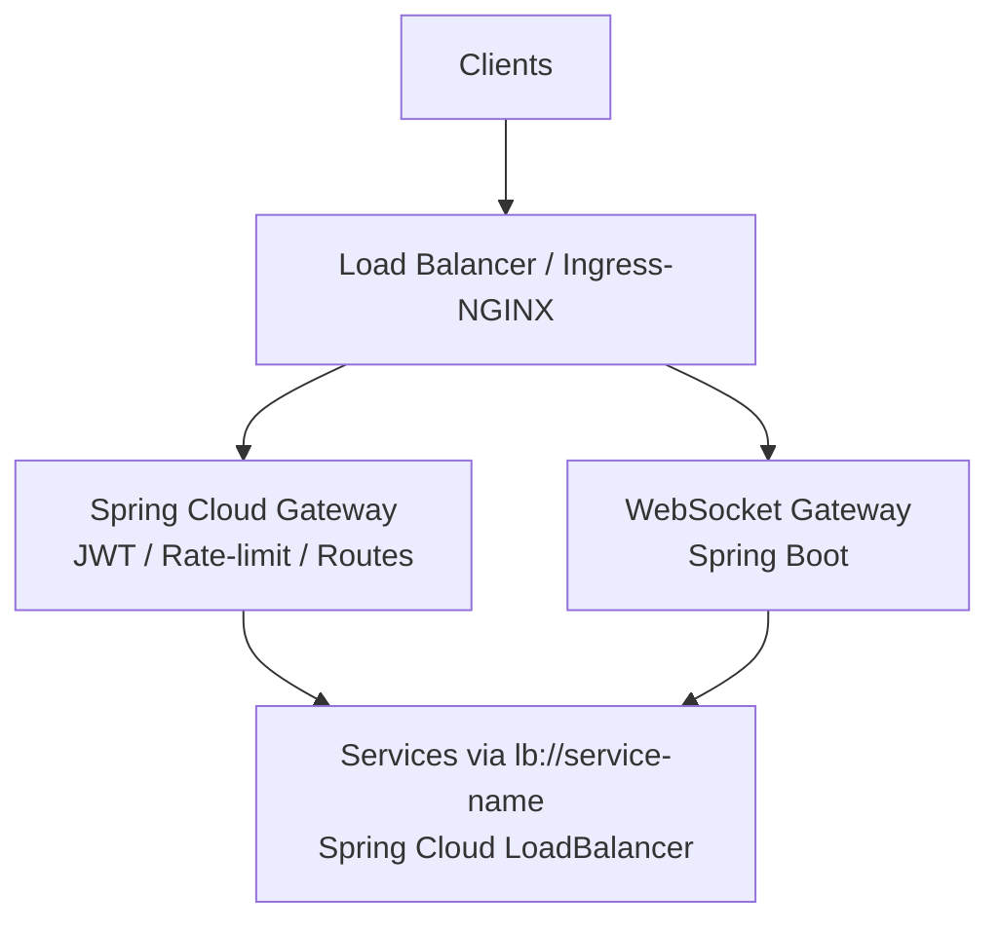

# 11 — Deployment & Infrastructure (Spring Boot on Kubernetes)

How Spring Boot services are packaged, exposed, observed, and operated.

---

## 1. Packaging — Spring Boot Docker images

Use the **Spring Boot Maven/Gradle plugin with Buildpacks** (no hand-written
Dockerfile needed). This produces OCI-compliant, layered images with a non-root
user out of the box:

```xml
<!-- pom.xml -->
<plugin>
  <groupId>org.springframework.boot</groupId>
  <artifactId>spring-boot-maven-plugin</artifactId>
  <configuration>
    <image>
      <name>registry.example.com/${project.artifactId}:${project.version}</name>
    </image>
    <layers>
      <enabled>true</enabled>  <!-- layered jar for faster rebuilds -->
    </layers>
    <jvmArguments>
      <!-- G1GC, tuned for containers -->
      -XX:+UseG1GC
      -XX:MaxRAMPercentage=75.0
      -Djava.security.egd=file:/dev/./urandom
    </jvmArguments>
  </configuration>
</plugin>
```

```bash
mvn spring-boot:build-image -pl user-service
docker push registry.example.com/user-service:1.0.0
```

---

## 2. Kubernetes deployment

### Spring Boot Actuator as liveness / readiness probes

Every service exposes `/actuator/health/liveness` and `/actuator/health/readiness`
out of the box:

```yaml
# application.yml
management:
  endpoint:
    health:
      probes:
        enabled: true
      show-details: always
  endpoints:
    web:
      exposure:
        include: health,info,metrics,prometheus
```

```yaml
# k8s deployment.yaml (example for Trip Service)
apiVersion: apps/v1
kind: Deployment
metadata:
  name: trip-service
spec:
  replicas: 3
  selector:
    matchLabels:
      app: trip-service
  template:
    spec:
      containers:
        - name: trip-service
          image: registry.example.com/trip-service:1.0.0
          ports:
            - containerPort: 8080
            - containerPort: 9090   # gRPC
          env:
            - name: SPRING_PROFILES_ACTIVE
              value: "prod"
            - name: SPRING_CONFIG_IMPORT
              value: "configserver:http://config-server:8888"
            - name: EUREKA_CLIENT_SERVICEURL_DEFAULTZONE
              value: "http://eureka-server:8761/eureka/"
          livenessProbe:
            httpGet:
              path: /actuator/health/liveness
              port: 8080
            initialDelaySeconds: 30
            periodSeconds: 10
          readinessProbe:
            httpGet:
              path: /actuator/health/readiness
              port: 8080
            initialDelaySeconds: 15
            periodSeconds: 5
          resources:
            requests:
              memory: "512Mi"
              cpu: "250m"
            limits:
              memory: "1Gi"
              cpu: "1000m"
```

### Horizontal Pod Autoscaling

HPA is driven by the right signal per service. Kafka consumer lag metrics are
exposed via Micrometer and the `kafka-lag-exporter` sidecar:

```yaml
# WS Gateway — scale on memory (connection density)
apiVersion: autoscaling/v2
kind: HorizontalPodAutoscaler
metadata:
  name: ws-gateway-hpa
spec:
  scaleTargetRef:
    apiVersion: apps/v1
    kind: Deployment
    name: ws-gateway
  minReplicas: 2
  maxReplicas: 20
  metrics:
    - type: Resource
      resource:
        name: memory
        target:
          type: Utilization
          averageUtilization: 70

# Matching / Trip — scale on Kafka consumer lag
---
apiVersion: autoscaling/v2
kind: HorizontalPodAutoscaler
metadata:
  name: matching-service-hpa
spec:
  scaleTargetRef:
    apiVersion: apps/v1
    kind: Deployment
    name: matching-service
  minReplicas: 2
  maxReplicas: 10
  metrics:
    - type: External
      external:
        metric:
          name: kafka_consumergroup_lag
          selector:
            matchLabels:
              topic: ride.requests
              group: matching-service
        target:
          type: AverageValue
          averageValue: "100"
```

---

## 3. Edge & routing — Spring Cloud Gateway



```yaml
# Spring Cloud Gateway — application.yml
spring:
  cloud:
    gateway:
      default-filters:
        - name: RequestRateLimiter
          args:
            redis-rate-limiter.replenishRate: 100
            redis-rate-limiter.burstCapacity: 200
            key-resolver: "#{@userKeyResolver}"
      routes:
        - id: user-service
          uri: lb://user-service
          predicates: [Path=/auth/**, /users/**]
          filters:
            - AuthJwtFilter

        - id: trip-service
          uri: lb://trip-service
          predicates: [Path=/trips/**]
          filters:
            - AuthJwtFilter

        - id: driver-service
          uri: lb://driver-service
          predicates: [Path=/drivers/**]
          filters:
            - AuthJwtFilter

        - id: pricing-service-ops
          uri: lb://pricing-service
          predicates: [Path=/pricing/**]
          filters:
            - AuthJwtFilter
            - name: CircuitBreaker
              args:
                name: pricing-cb
                fallbackUri: forward:/fallback/pricing
```

```java
@Component
public class AuthJwtFilter implements GatewayFilter, Ordered {

    private final ReactiveJwtDecoder jwtDecoder;

    @Override
    public Mono<Void> filter(ServerWebExchange exchange, GatewayFilterChain chain) {
        String token = extractToken(exchange.getRequest());
        if (token == null) return unauthorized(exchange);

        return jwtDecoder.decode(token)
            .flatMap(jwt -> {
                exchange.getRequest().mutate()
                    .header("X-User-Id", jwt.getSubject())
                    .header("X-User-Role", jwt.getClaimAsString("role"))
                    .build();
                return chain.filter(exchange);
            })
            .onErrorResume(JwtException.class, e -> unauthorized(exchange));
    }

    @Override public int getOrder() { return -1; }
}
```

---

## 4. Data infrastructure

| Component | Mode | Spring integration |
|-----------|------|--------------------|
| PostgreSQL | Primary + read replicas | `spring-boot-starter-data-jpa` + `AbstractRoutingDataSource` for replica routing |
| Redis | Cluster / Sentinel HA | `spring-boot-starter-data-redis` + Lettuce auto-failover |
| Kafka | Multi-broker cluster | `spring-cloud-stream-binder-kafka` + Confluent Schema Registry |
| MongoDB | Replica set | `spring-boot-starter-data-mongodb` |
| Cassandra | Multi-node ring | `spring-boot-starter-data-cassandra` |
| TimescaleDB | PostgreSQL extension | Same JPA stack; native `@Query` for time-bucket functions |

---

## 5. Observability — Spring Boot Actuator + Micrometer

### Metrics → Prometheus → Grafana

```xml
<dependency>
  <groupId>io.micrometer</groupId>
  <artifactId>micrometer-registry-prometheus</artifactId>
</dependency>
```

```yaml
management:
  metrics:
    export:
      prometheus:
        enabled: true
  endpoint:
    prometheus:
      enabled: true
```

Custom business metrics:

```java
@Component
public class MatchingMetrics {

    private final Counter matchSuccessCounter;
    private final Counter matchFailureCounter;
    private final Timer matchLatencyTimer;

    public MatchingMetrics(MeterRegistry registry) {
        matchSuccessCounter = Counter.builder("matching.success.total")
            .tag("service", "matching")
            .register(registry);
        matchLatencyTimer = Timer.builder("matching.latency")
            .publishPercentiles(0.50, 0.95, 0.99)
            .register(registry);
    }

    public void recordSuccess(Duration elapsed) {
        matchSuccessCounter.increment();
        matchLatencyTimer.record(elapsed);
    }
}
```

Key SLO dashboards: match latency p99, location-ingest throughput, end-to-end
trip-event Kafka lag, WS push latency, payment failure rate.

### Distributed tracing — Micrometer Tracing + OpenTelemetry

```xml
<dependency>
  <groupId>io.micrometer</groupId>
  <artifactId>micrometer-tracing-bridge-otel</artifactId>
</dependency>
<dependency>
  <groupId>io.opentelemetry</groupId>
  <artifactId>opentelemetry-exporter-zipkin</artifactId>
</dependency>
```

```yaml
management:
  tracing:
    sampling:
      probability: 0.1      # 10% sampling in prod; 1.0 in dev
  zipkin:
    tracing:
      endpoint: http://zipkin:9411/api/v2/spans
```

`trip_id` is propagated as an OpenTelemetry Baggage item across REST → gRPC →
Kafka hops so every log line and span is correlatable end-to-end.

### Structured logging

```xml
<!-- logback-spring.xml -->
<dependency>
  <groupId>net.logstash.logback</groupId>
  <artifactId>logstash-logback-encoder</artifactId>
</dependency>
```

MDC is populated automatically by Micrometer Tracing (`traceId`, `spanId`); add
`tripId` manually in command/consumer entry points. Logs ship to ELK or Loki.

---

## 6. Resilience patterns (Spring / Resilience4j)

```yaml
resilience4j:
  circuitbreaker:
    instances:
      pricing:
        sliding-window-size: 20
        failure-rate-threshold: 50
        wait-duration-in-open-state: 10s
        permitted-number-of-calls-in-half-open-state: 5
  timelimiter:
    instances:
      pricing:
        timeout-duration: 500ms
  retry:
    instances:
      default:
        max-attempts: 3
        wait-duration: 200ms
        exponential:
          multiplier: 2
          max-wait-duration: 2s
  bulkhead:
    instances:
      payments:
        max-concurrent-calls: 10  # isolate payment thread pool
```

- **Timeouts + retries with exponential backoff** on every cross-service gRPC call.
- **Circuit breakers** around external providers (Stripe/payments, FCM, SMS, Maps).
- **Bulkheads** via separate Resilience4j `Bulkhead` instances per dependency.
- **Graceful degradation** rules per service (see each service doc).

---

## 7. Security

| Concern | Spring implementation |
|---------|----------------------|
| JWT validation at edge | Spring Cloud Gateway `AuthJwtFilter` + `ReactiveJwtDecoder` |
| JWT validation in services | `spring-boot-starter-oauth2-resource-server` |
| Service-to-service mTLS | Spring Boot `server.ssl.*` + client keystore on gRPC channel |
| Secrets management | HashiCorp Vault via `spring-cloud-vault`; never in env files |
| DB credentials | Vault dynamic secrets; least-privilege per service |
| PCI scope | Only tokenized references stored; raw numbers never reach the app |
| PII encryption | Hibernate `@Convert` with AES-256; column-level encryption |

---

## 8. CI/CD

```yaml
# Per-service GitHub Actions pipeline (example)
jobs:
  build-and-deploy:
    steps:
      - name: Build & test
        run: mvn verify
      - name: Build OCI image
        run: mvn spring-boot:build-image
      - name: Container scan (Trivy)
        run: trivy image registry.example.com/trip-service:$VERSION
      - name: Push image
        run: docker push registry.example.com/trip-service:$VERSION
      - name: Deploy canary (10%)
        run: kubectl argo rollouts set image trip-service ...
      - name: Promote to 100%
        run: kubectl argo rollouts promote trip-service
```

- **Per-service pipelines** — each Spring Boot module is built, tested, and
  containerized independently; deployments are fully decoupled.
- **Progressive delivery:** Argo Rollouts canary (10% → 50% → 100%) for Matching
  and Pricing where logic changes are risky.
- **Contract tests on Kafka schemas:** Pact or Confluent Schema Registry
  compatibility checks run in CI; a producer schema change that breaks a consumer
  fails the build.
- **Flyway migrations** run automatically on startup. For read models, drop + replay
  Kafka rather than migrating MongoDB in place.
- **Spring Boot test slices** (`@WebMvcTest`, `@DataJpaTest`, `@DataMongoTest`)
  speed up unit and integration tests; Testcontainers provides real PostgreSQL,
  Redis, Kafka, MongoDB, and Cassandra in CI.
