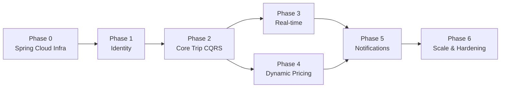

# 12 — Implementation Roadmap (Spring Boot & Spring Cloud)

A phased plan that delivers a working core first, then layers on real-time, dynamic
pricing, and scale. Each phase ends with something demonstrable. The sequencing rule:
**build the correct, durable core first** (identity + trip state via CQRS), then add
real-time and dynamic layers on top.

---

## Phase 0 — Foundations (Spring Cloud infrastructure)

- **Monorepo / multi-module Maven (or Gradle)** structure:
  `platform/user-service`, `platform/driver-service`, etc., plus shared modules:
  `platform/common-events` (domain event records), `platform/common-security`
  (JWT filter), `platform/common-tracing`.
- **Spring Cloud Config Server** — Git-backed; all service configs live here from
  day one. No service ships with secrets or env-specific values in `application.yml`.
- **Spring Cloud Netflix Eureka Server** — standalone Spring Boot app; all services
  register at startup.
- **Kafka cluster** (multi-broker) + **Confluent Schema Registry** — define the
  event schema catalog now; it's the contract everything builds on.
- **CI/CD pipeline per service** — `mvn verify` → `spring-boot:build-image` →
  container scan → Kubernetes deploy. Use Testcontainers for integration tests.
- **Spring Boot Actuator + Micrometer + Prometheus/Grafana** — observability wired
  from the first commit, not added later.

**Exit criteria:** an empty Spring Boot service can start, register with Eureka,
pull its config from Config Server, emit a test event to Kafka, and have its traces
appear in Zipkin end-to-end.

---

## Phase 1 — Identity & accounts

- **User Service** (Spring Boot + Spring Data JPA / PostgreSQL + Spring Security):
  register, login, JWT issuance (RS256), profile CRUD, payment-method tokens, Redis
  caching with `@Cacheable`.
- **Driver Service** (Spring Boot + Spring Data JPA / PostgreSQL + Spring Data Redis):
  onboarding, vehicle, document upload, approval status, `@Scheduled` document-
  expiry job.
- **Spring Cloud Gateway** wired with `AuthJwtFilter`; JWKS endpoint from User
  Service cached at the gateway.
- Flyway migrations for both services run on startup.

**Exit criteria:** riders and drivers can sign up, authenticate, receive a JWT, and
be approved. All endpoints are rate-limited and JWT-protected at the gateway.

---

## Phase 2 — Core trip flow (CQRS, no real-time yet)

- **Trip Service** with full CQRS:
  - Write side: Spring Data JPA / PostgreSQL (`trips`, `trip_events`, `outbox`);
    `@Transactional` command handlers; `@Scheduled` outbox relay → Spring Cloud
    Stream → Kafka `trip.events`.
  - Read side: Spring Data MongoDB projector consuming `trip.events`.
- **Pricing Service** — base fare only (no surge yet); gRPC `EstimateFare` /
  `LockFare`; fare rules in Spring Data JPA / PostgreSQL.
- **Matching Service** — naive implementation: pick any online driver from a short
  in-memory list polled from Driver Service gRPC; no geo yet.
- Wire the saga via Spring Cloud Stream: `RideRequested` → `DriverMatched` →
  `TripStarted` → `TripCompleted`. Resilience4j circuit breakers on every gRPC hop.

**Exit criteria:** a rider can request, get matched, ride, and complete a trip
entirely through REST + Kafka events; ride history shows up from the MongoDB read
model.

---

## Phase 3 — Real-time layer

- **WebSocket Gateway Service** — Spring Boot + `@EnableWebSocketMessageBroker`,
  STOMP broker relay backed by Redis Pub/Sub (Lettuce), JWT handshake interceptor,
  connection registry in Spring Data Redis.
- **Redis geospatial location ingestion** — Driver app sends GPS frames over STOMP;
  `GeoOperations.add()` in the `@MessageMapping` handler; no JPA on hot path.
- **Live driver tracking** — rider subscribes to `/topic/trip/{id}/driverloc`;
  frames fan out via STOMP broker relay.
- **Matching Service** switches to `GeoOperations.radius()` on `drivers:geo:{city}`;
  reservation locks via `setIfAbsent` (SET NX TTL); expanding-radius algorithm.
- Trip-state changes (`DriverMatched`, `TripStarted`, `TripCompleted`) fan out to
  WebSocket clients via Spring Cloud Stream consumer in WS Gateway.

**Exit criteria:** riders see the driver moving on the map in real time (sub-second
updates); matching completes in low tens of milliseconds using live Redis geo-index.

---

## Phase 4 — Dynamic pricing

- **Pricing Service** surge path:
  - Redis demand/supply counters (`ValueOperations.increment()`) updated by Spring
    Cloud Stream consumers (`onRideRequested`, `onDriverOnline`, `onDriverOffline`).
  - `@Scheduled` `SurgeCalculatorJob` computes multiplier per zone, stores in Redis
    with TTL, publishes `SurgeUpdated`.
  - TimescaleDB (`spring-data-jpa` + native `@Query`) for surge history and audit.
- Surge cap and sensitivity in Config Server; tunable via `/actuator/refresh` without
  redeployment (`@RefreshScope`).
- Matching Service calls `Pricing.LockFare` gRPC at match time; Trip finalizes with
  `Pricing.FinalizeFare` on completion.

**Exit criteria:** fares rise and fall with real demand; every multiplier is
auditable in TimescaleDB; A/B test a pricing strategy by changing a Config Server
property.

---

## Phase 5 — Notifications & polish

- **Notification Service** (Spring Boot + Spring Data Cassandra + Spring Data Redis):
  - Spring Cloud Stream consumers for all domain events.
  - Push via Firebase Admin SDK (circuit-breakered); SMS + email providers.
  - Dedupe via `setIfAbsent`; rate-limiting via Redis counter + TTL.
  - Delivery log to Cassandra `notifications_by_user` table.
  - In-app notifications via Redis Pub/Sub → WS Gateway STOMP topic.
- Ratings flow: `TripCompleted` → User Service `onTripCompleted` consumer creates
  `history_index` row and optionally triggers rating prompt.
- Cancellation fees: Trip Service applies fee logic in `cancel()` command.
- Promos: Pricing Service reads promo rules from Config Server / fare rule table.

**Exit criteria:** users receive timely, deduped notifications on push/SMS/email/
in-app across the full trip lifecycle; quiet hours and channel preferences respected.

---

## Phase 6 — Hardening & scale

- **Load test** hot paths (location ingest, matching, surge reads) with k6 or
  Gatling; instrument with Micrometer timers.
- **Redis Cluster mode** — `spring.data.redis.cluster.*`; Lettuce handles topology
  changes transparently.
- **Kafka partition tuning** — increase `ride.requests` partitions to match peak
  city concurrency; add Matching consumer replicas.
- **PostgreSQL read replicas** — `AbstractRoutingDataSource` routes `@Transactional(readOnly=true)` queries to replicas.
- **Resilience4j chaos testing** — use `spring-cloud-circuitbreaker` test utilities
  to inject failures and verify fallbacks.
- **Spring Cloud Kubernetes** (optional) — replace Eureka with K8s-native service
  DNS discovery for simpler operations in a pure-K8s environment.
- **Decide on Trip write-side evolution** — if write volume or multi-region needs
  demand it, migrate Trip's write store from PostgreSQL to Cassandra or a dedicated
  event store (EventStore, Axon Server).

**Exit criteria:** the system meets latency/throughput SLOs under realistic peak
load; chaos tests pass; all circuit breakers, retries, and fallbacks are verified.

---

## Dependency order



---

## Spring Boot module structure (monorepo suggestion)

```
platform/
├── common-events/          # Shared domain event records + Avro/JSON schemas
├── common-security/        # JWT filter, JWKS client, @PreAuthorize helpers
├── common-tracing/         # Micrometer Tracing config, MDC setup
├── config-server/          # Spring Cloud Config Server app
├── eureka-server/          # Spring Cloud Netflix Eureka Server app
├── api-gateway/            # Spring Cloud Gateway app
├── ws-gateway/             # Spring WebSocket + STOMP gateway app
├── user-service/
├── driver-service/
├── matching-service/
├── pricing-service/
├── trip-service/
└── notification-service/
```

Each service has its own `pom.xml` (inherits from `platform/pom.xml`), its own
Flyway migrations, its own Kubernetes `deployment.yaml`, and is deployed and versioned
independently. The shared modules are published to a private Maven repository.
